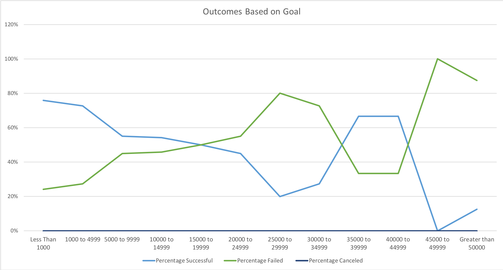
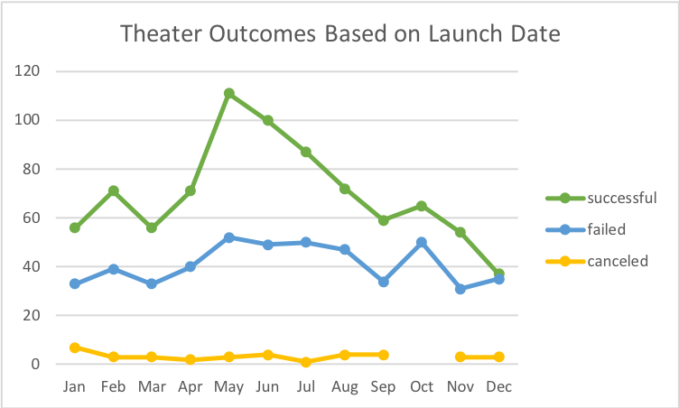

# Kickstarter-Analysis
Analysis on Kickstarter crowdfunding projects

## Overview of Project

### Purpose
The purpose of this project is to analyze kickstarter campaigns in order to discover relationships between different factors involved in launching a campaign. This data set was used to perform an analysis to help a play reach their fundraising goal. Now that the play is close to reaching their goal amount, we are interested in analyzing campaign outcomes against different variables. We are primarily concerned with two factors: launch dates and funding goals.  

## Analysis and Challenges
Within this project I focused on analyzing campaign outcomes based on launch dates and funding goals, narrowing down on the parent category of theater and subcategory of plays, respectively

### Analysis of Outcomes Based on Launch Date
To identify how the launch date affected outcomes I created a Pivot Table and Chart. In the Table, I filtered by ‘Parent Category’ and ‘Year’, used ‘Outcomes’ for columns as well as values. and ‘Date Created” for rows. The category of focus for this data is “Theater”, so I filtered to only display these values. I grouped the Rows by Months to make the data easier to read. I then created a Pivot Chart from this data to visualize the relationship between Launch Dates and Outcomes

### Analysis of Outcomes Based on Goals
To analyze Outcomes based on Goals I started by creating a new sheet and listing ranges for the different goal amounts in Column A, naming this column “Goal’, (Less than 1000,1000-4999…Greater than 50000). Column B, C, and D I named “Number Successful”, “Number Failed”, and “Number Canceled”, respectively. Next I used the COUNTIF() equation to return from the original dataset the Number of Successful, Failed, and Cancelled projects for the subcategory of plays. Cell B3 had the formula:
=COUNTIFS(Kickstarter!$F:$F,"successful",Kickstarter!$D:$D,">=1000",Kickstarter!$D:$D,"<=4999",Kickstarter!$R:$R,"plays")

In Column E, I calculated the “Total Projects” for each goal range using the SUM() formula. 
In Column F, G, and H, I calculated the percentage of each Outcome. 
From this data, I created a Line Chart to show the relationship between the percentage of each outcome compared to the goal amount.

### Challenges and Difficulties Encountered
A challenge I faced was formatting the formula I wrote in the sheet named ‘Outcomes Based on Goals” in Column B. At first, I did not think about this issue, but when I tried copying the formula from B2 into C2 and changed the Criteria 1 to find ‘failed’ outcomes, it did not work. I realized I needed to change the formula to include ‘$’ to ensure the columns being referenced stayed the same.

## Results
- What are two conclusions you can draw about the Outcomes based on Launch Date?

The first conclusion I can draw is that Launch Dates seem to have little to no affect on whether the outcome of a campaign is “canceled”. The line stays between 1-10 throughout all of the months. 

The second conclusion I can draw is that the month of May had the highest number of Successful campaigns, with June and July also having a high number of successful campaigns. This means the early summer months have higher rates of successful campaigns.

- What can you conclude about the Outcomes based on Goals?

From this data set I can conclude that there is a negative linear relationship between Funding Goals and the Success of a Campaign until the campaign goal exceeds $29,999. 

- What are some limitations of this dataset?

One major limitation of this data is that we don’t have information on tactics individuals used to raise the pledged amount. It would be extremely helpful to know what methods were successful and learn from failures. 

- What are some other possible tables and/or graphs that we could create?

From the dataset we can look at the length of time vs fundraising outcome in a graph to visualize trends. From this trend we can see typically how long it takes for a successful campaign to reach their goal amount.

